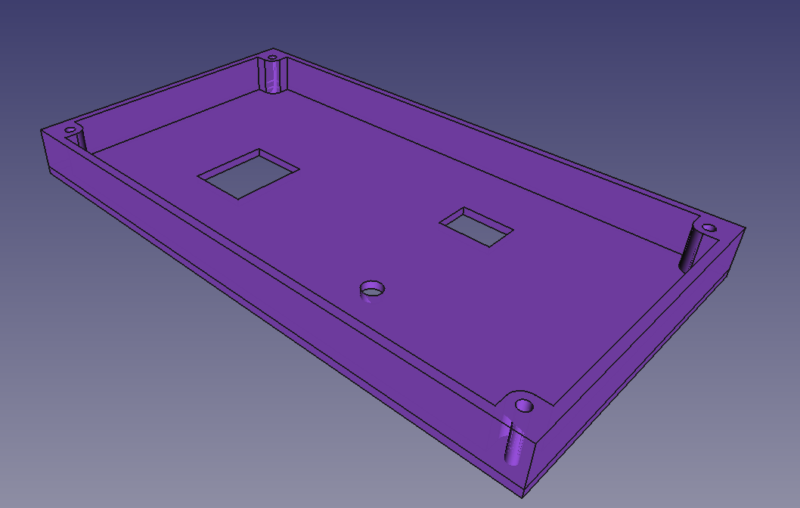
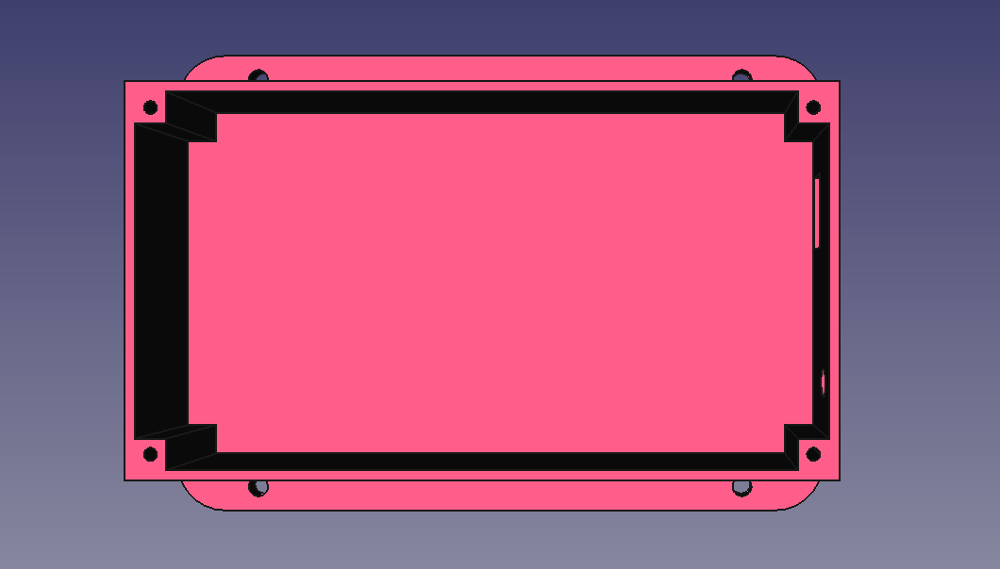
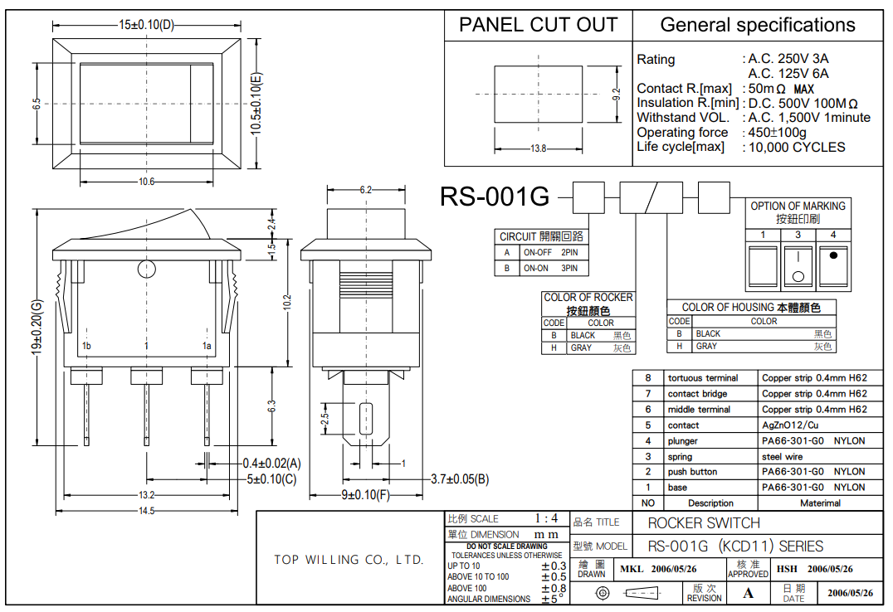
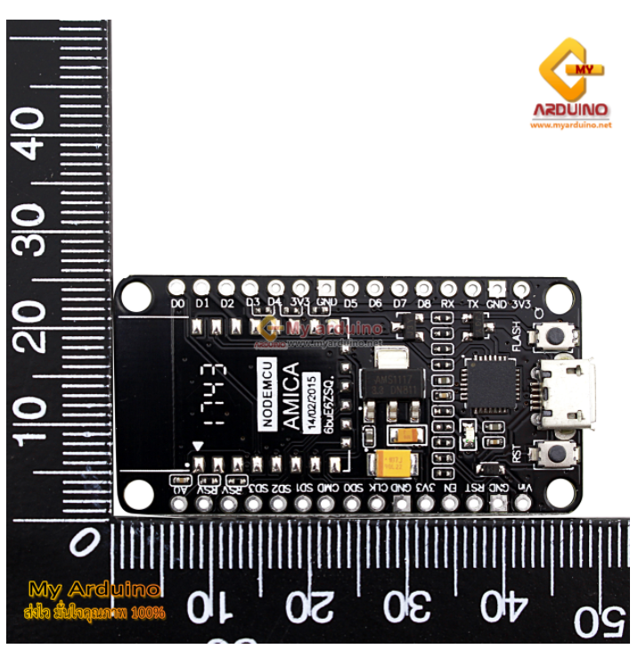
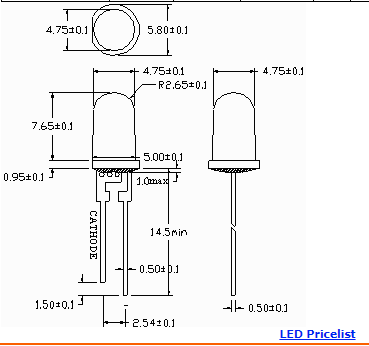
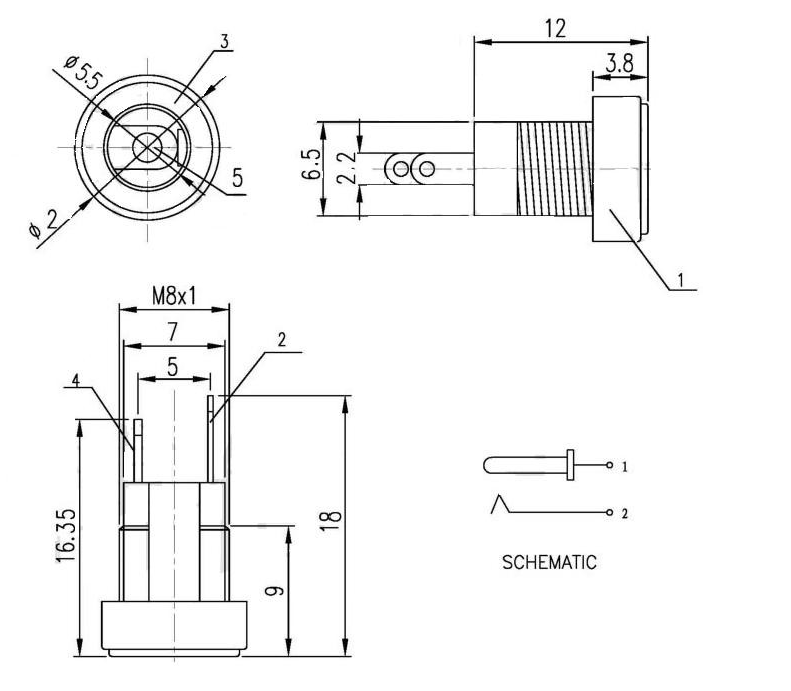
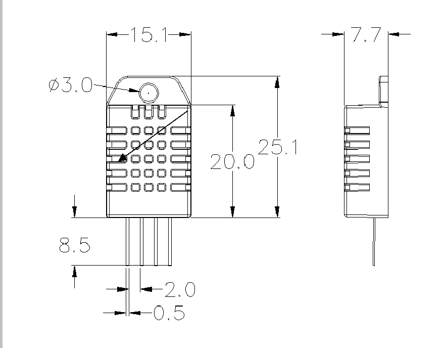
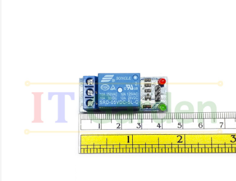

# CPE405-HW1-61024246

Model
 

อุปกรณืที่ใช้ในการออกแบบ Model

มี Switch

https://www.jameco.com/Jameco/Products/ProdDS/2208198.pdf

EPS8266

https://www.myarduino.net/product/3846/adapter-plate-nodemcu-lua-wifi-compatible-development-board-esp8266-12e-12f-cp2102

LEDs

https://ledz.com/?p=led.az.0.5W

Pcs

https://th.aliexpress.com/item/32599220409.html

DHT22

https://html.alldatasheet.com/html-pdf/1132459/ETC2/DHT22/457/4/DHT22.html

PhotoBoard

Relay

https://shopee.co.th/%E0%B9%82%E0%B8%A1%E0%B8%94%E0%B8%B9%E0%B8%A5%E0%B8%A3%E0%B8%B5%E0%B9%80%E0%B8%A5%E0%B8%A2%E0%B9%8C-Module-Relay-1-Channel-DC-5V-12V-Active-Low-Level-Trigger-i.128765755.4416500950

